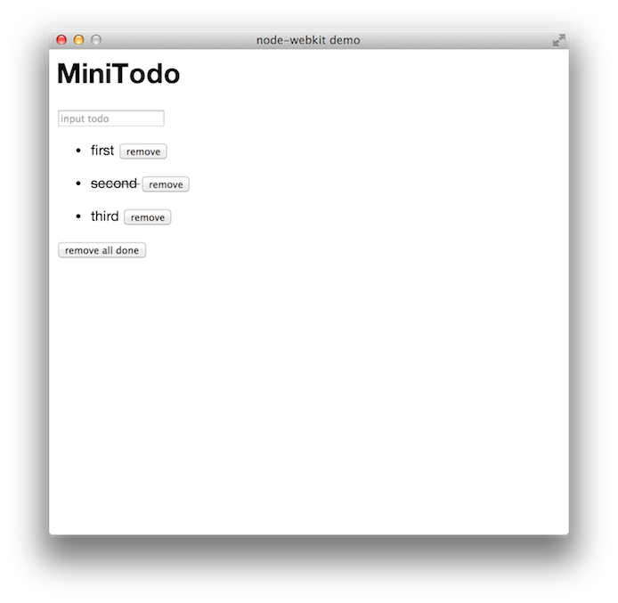
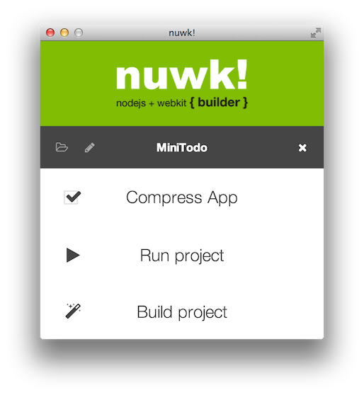

MiniTodo
========
[node-webkit](https://github.com/rogerwang/node-webkit) + [vue.js](http://vuejs.org) build with [nuwk!](http://codeb.it/nuwk/) demo

# Build

1. install [node-webkit](https://github.com/rogerwang/node-webkit#downloads)
2. install [nuwk!](http://codeb.it/nuwk/)
3. download [MiniTodo zip](https://github.com/airtoxin/MiniTodo/archive/master.zip)
4. `$ cd MiniTodo/App; npm i`
5. opem MiniTodo directory with nuwk! and click "Build project"

